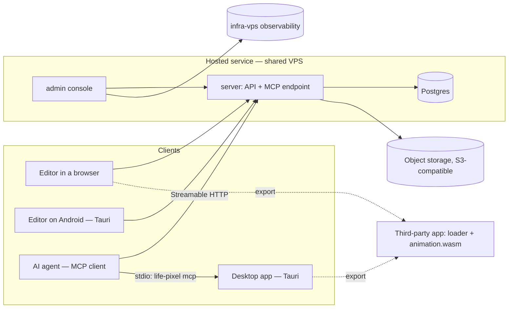
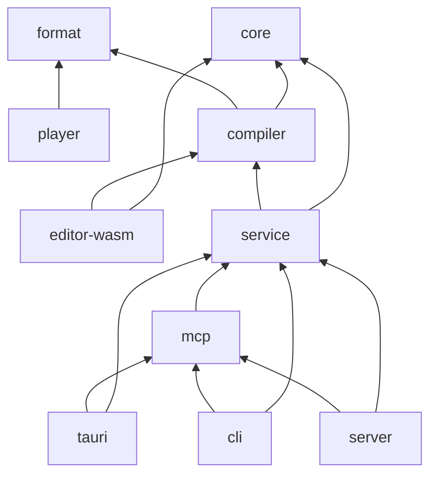

# Architecture

This document describes the target. Items marked *proposed* depend on a decision the
maintainer has not settled yet — see [decisions.md](decisions.md).

## Overview

## One core, many shells

The same Rust code runs everywhere a pixel is touched (D20):

- in the **editor**, compiled to WebAssembly (`editor-wasm`): drawing, compositing, previewing and
  exporting happen on the user's device, without a round trip;
- on the **server**, which validates every saved document with the same rules, enforces quotas
  and serves the MCP tools;
- in the **CLI** and the **Tauri apps**, natively;
- in the **player**, reduced to what playback needs.

The consequence is the product's guarantee: the editor shows exactly what the export plays, and
a rule — a canvas limit, a palette size, a decoding step — is written once.

## Crates

| Crate | Package | Licence | Role |
|---|---|---|---|
| `crates/core` | `life-pixel-core` | AGPL-3.0-only | document model (projects, animations, layers, frames, cels, palettes, tags), validation, domain limits, editing operations, compositing — pure |
| `crates/format` | `life-pixel-format` | MIT | binary format of a compiled animation: versioned, `no_std` decoder, encoder behind a feature |
| `crates/player` | `life-pixel-player` | MIT | the runtime compiled to WebAssembly: decodes the payload, advances time, fills a framebuffer |
| `crates/compiler` | `life-pixel-compiler` | AGPL-3.0-only | document → exports: WASM bundle, GIF, APNG, sprite sheet and JSON, PNG frames |
| `crates/editor-wasm` | `life-pixel-editor-wasm` | AGPL-3.0-only | wasm-bindgen facade over `core` and `compiler` for the Angular editor |
| `crates/service` | `life-pixel-service` | AGPL-3.0-only | use cases (create, edit, save, export, check quotas), the ports they need, and the local file adapter |
| `crates/mcp` | `life-pixel-mcp` | AGPL-3.0-only | MCP tools over `service`, independent of the transport |
| `crates/server` | `life-pixel-server` | AGPL-3.0-only | axum HTTP API, MCP endpoint, Postgres and object-storage adapters |
| `crates/admin-server` | `life-pixel-admin-server` | AGPL-3.0-only | admin, support and metrics API |
| `crates/cli` | `life-pixel-cli` (binary `life-pixel`) | AGPL-3.0-only | local export, MCP over stdio |

- `admin-server` depends on no domain crate: it talks to `server` through its internal admin API
  and to the observability stack, so that business rules stay in one place.
- The MIT crates never depend on an AGPL one (D15). The graph guarantees it: `format` depends on
  nothing, `player` on `format` only.
- The compiler embeds the player binary built from the same commit. The build orchestrates it (a
  script or an `xtask`), never by downloading a binary.
- Crates are created when their code appears, not ahead of it.

## Front-end

One Angular workspace, `frontend/`:

| Project | Role | Runs on |
|---|---|---|
| `projects/app` | the editor and everything around it: library, export, account, settings | browsers; the desktop and Android through Tauri |
| `projects/admin` | the admin, support and metrics console | browsers |
| `projects/shared` | design tokens, shared components, i18n setup, typed API client | — |

`projects/app` uses Ionic for the application shell and the mobile experience; the canvas and
the timeline are custom components backed by `editor-wasm`, with long operations in a Web
Worker. The same build is served by the server to browsers, and packaged by Tauri for the
desktop and Android. Translations are not part of it: the app fetches them at runtime, one
language at a time, from the i18n endpoint — see [i18n.md](i18n.md).

## Tauri apps

`tauri/` is a single Tauri 2 project, member of the Cargo workspace, that loads the built
`projects/app` (D13). Two modes, split with Tauri's `desktop` and `mobile` build flags:

| Target | Mode | Back-end | Sign-in |
|---|---|---|---|
| Desktop — Windows, macOS, Linux | local | `service` in-process on a local library folder; ships the `life-pixel` CLI for MCP over stdio | none; a hosted account only for sync, a paid service (D25) |
| Android — iOS later | connected | the hosted API | OAuth 2.1 with PKCE, through the system browser and a deep link back |

A packaged app calls the API from its own origin (`tauri://localhost`, `http://tauri.localhost`).
Session cookies would be third-party cookies there, which webviews block: the apps use bearer
tokens kept in the platform's keystore, and the server allows those origins explicitly (CORS).
The OAuth 2.1 authorization server they need is the one MCP connectors use.

## Data

Hosted and self-hosted:

- **Postgres** holds accounts, plans, storage accounting, tokens, projects and animations
  metadata, support requests, the audit log and product events;
- **object storage** (S3 API through `object_store`) holds document bodies and imported images,
  in an external bucket: user data stays off the VPS disk, which every project of the host
  shares, and the database is backed up off the VPS (D16).

Desktop and CLI: a library folder of project files, written by the local adapter of `service`.
Files keep projects portable and friendly to version control.

Exports are never stored: they are compiled on demand, in milliseconds, from the document.

## Distributions

| Distribution | Technology | Back-end | Data | MCP |
|---|---|---|---|---|
| Web app (hosted) | `projects/app` served by `server` | hosted server | Postgres + object storage | Streamable HTTP |
| Android (iOS later) | the same app, packaged by Tauri 2 | hosted server | hosted | through the hosted endpoint |
| Desktop — Windows, macOS, Linux | the same app, packaged by Tauri 2 | `service` in-process | local library folder | stdio through `life-pixel mcp` |
| Self-hosted server | the same Docker images as the hosted service | the user's server | the user's Postgres and storage | Streamable HTTP |

- **Web**: the single-page app and the API share one origin — no CORS to maintain for browsers.
- **Android**: sells nothing in the app (D18). Pointing it at a self-hosted server is a later
  setting.
- **Desktop**: works offline and without an account, ships the `life-pixel` CLI so that a local
  agent can reach the library over stdio, updates itself through the signed Tauri updater, and
  sends no telemetry unless the user opts in (D24).
- **Self-hosted**: our images are public on GHCR; a compose example with Postgres and any
  S3-compatible storage (or a local volume) is provided. Billing is simply not configured.

## Services and images

| Image (D22) | Content | Public |
|---|---|---|
| `app` | `server` binary + the built `projects/app` | yes, through the edge |
| `admin` | `admin-server` binary + the built `projects/admin` | yes, through the edge, admin accounts only |

Postgres runs next to them in each environment. Object storage is external.

## Compatibility

- The HTTP API is versioned (`/api/v1`). Clients send their platform and version; the server can
  answer `426 Upgrade Required` to a mobile app too old for the current API.
- The export format and the player ABI are versioned — see [export.md](export.md).
- The project document is versioned; `core` migrates older documents on read.

## Technology choices

Versions at the time of writing (2026-09); lockfiles and toolchain files pin the exact ones.

| Concern | Choice | Status |
|---|---|---|
| Core, back-end, WebAssembly | Rust 1.98, edition 2024 | accepted (D1) |
| HTTP | axum 0.8, tokio, tower-http | accepted (D21) |
| Database | Postgres through sqlx | accepted (D21) |
| Object storage | an external bucket, reached through `object_store` | accepted (D16, D21) |
| MCP | `rmcp`, the official Rust SDK | accepted (D21) |
| OpenAPI | `utoipa`, the TypeScript client generated from it | accepted (D21) |
| Editor bindings | `wasm-bindgen` | accepted (D21) |
| Application front-end | Angular 22, Ionic 9 | accepted (D2) |
| Desktop and mobile shell | Tauri 2 | accepted (D13) |
| Internationalisation | catalogues served by an endpoint (D26); Transloco on the client (P10) | accepted, library proposed |
| Front-end tests | Vitest, Playwright | accepted (D21) |
| Observability | `tracing`, OpenTelemetry, Prometheus metrics, collected by infra-vps | accepted (D4, D17) |
