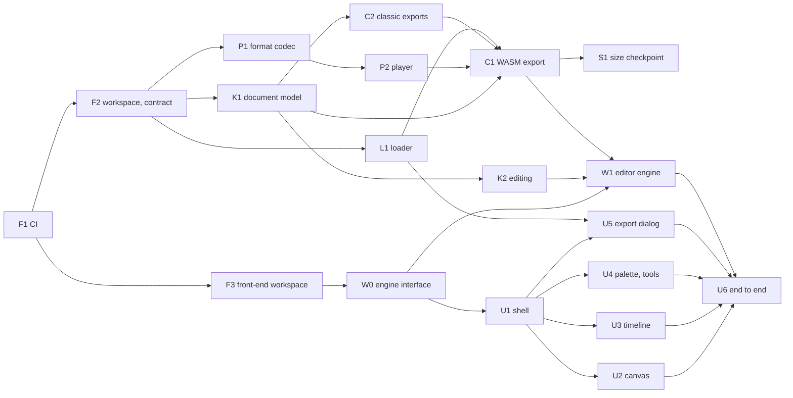

# Implementation plan

How the milestones of [product.md](product.md) become tasks that an orchestrator hands to agents
working in parallel (D19 in [decisions.md](decisions.md)). Each task says what it delivers, the
paths it owns, what it waits for and when it is done; the orchestrator writes each agent's brief
from it. M1 and M2, built in parallel, are detailed below; each later milestone is outlined, and
detailed here while the previous one is under way.

## Rules of the split

- **Contracts first.** What several streams share — the export format and the player ABI, the
  document model, the editor engine's interface — is fixed by one task before the streams that
  use it start. Until the real implementation lands, they work against the contract, with
  fixtures or a mock.
- **Disjoint ownership.** Tasks that run at the same time own disjoint paths. Shared files only
  receive additions: `[workspace.dependencies]`, the CI workflows, the i18n catalogues — keys
  under the task's own feature prefix — and the documentation maps.
- **A contract changes only through the task that owns it**, and the orchestrator warns every
  task that depends on it.
- **Done means verified.** A task ships its tests — the nominal behaviour and its edge cases —,
  passes the checks of AGENTS.md that cover what it touched, updates the documentation it
  affects, and adds the CI checks and the Dependabot entry of any area it creates.
- **One task, one branch**, named after it — `feat/format-codec`, `feat/timeline` —, merged into
  `dev` through a pull request. CI comes first, so that it checks every task after it.
- **A brief** quotes the task's row, the contracts it relies on and the documents it must follow:
  AGENTS.md always, plus those its row links.

## M1 and M2

### Foundations

| ID | Task | Owns | Waits for | Done when |
|---|---|---|---|---|
| F1 | Continuous integration | `.github/workflows/`, `.github/dependabot.yml` | — | `ci.yml`, `_verify.yml` and `security.yml` of [devops.md](devops.md) run on pull requests and on pushes to `dev`, starting with `cmp CLAUDE.md AGENTS.md`, CodeQL on the workflows and the dependency review; actions pinned to a commit SHA; Dependabot on `github-actions` |
| F2 | Cargo workspace and export contract | root `Cargo.toml`, `deny.toml`, `crates/format` | F1 | the workspace builds under the lints of AGENTS.md, and CI runs `fmt`, `clippy`, the tests and `cargo deny`; `crates/format` holds the types of payload v1 and player ABI v1 and the signatures of their codec, and its `README.md` specifies them byte by byte, linked from [export.md](export.md) |
| F3 | Front-end workspace | `frontend/` configuration, `i18n/`, `scripts/` | F1 | `projects/app` and `projects/shared` build under strict TypeScript, ESLint, Prettier at 100 columns, Vitest and Playwright; Transloco loads `i18n/en.json` and `fr.json` at runtime; CI runs the front-end checks and the catalogue check of [i18n.md](i18n.md) |

### M1 — core and player prototype

| ID | Task | Owns | Waits for | Done when |
|---|---|---|---|---|
| K1 | Document model | `crates/core` | F2 | projects, animations, palettes of 256 entries at most, layers, frames, cels and tags, with their validation and the domain limits as constants; a frame's compositing; versioned serialization, migrated on read; a frame to and from a text grid — the representation of MCP's `write_frame` and of the sample animations |
| P1 | Format codec | `crates/format` | F2 | the encoder, behind a feature, and the `no_std` decoder — bounds-checked, refusing an unknown version; round-trip tests; a `cargo fuzz` target that CI runs briefly on each pull request and longer every week, on a nightly toolchain; the v1 fixture, kept for good |
| P2 | Player | `crates/player`, `xtask/` | P1 | ABI v1 in `no_std`, without wasm-bindgen; `cargo xtask build-player` builds it reproducibly, and CI checks its hash, the 16 KiB budget and the frames it plays from the v1 fixture; every `unsafe` block carries a `// SAFETY:` comment |
| L1 | Loader and element | `player-js/` | F2 | the `<life-pixel>` element of [export.md](export.md) — attributes, methods, `tagend`, pause off-screen and in a hidden tab, reduced motion, accessible name — and the integration snippets, within 2 KiB gzipped; tested against a hand-written module implementing ABI v1, then against P2's player |
| C2 | Classic exports | `crates/compiler`, created here | K1 | GIF, APNG, sprite sheet with JSON and zipped PNG frames, deterministic, checked against golden files |
| C1 | WASM export | the WASM export's module in `crates/compiler` | K1, P2, C2, L1 | validate, flatten, encode and append the `life-pixel` section to the player built from the same commit; deterministic; golden files; the result plays in a browser through L1 |
| S1 | Size checkpoint | the sample animations, `scripts/`, the results in export.md | C1 | a few animations drawn for the project and dedicated to CC0 play in a demo page; a script measures them as WASM, GIF, APNG and WebP — the last through libwebp's tools, for the measurement only —, raw, gzipped and with brotli; the budgets of export.md are confirmed or revised once, and the sizes in [pricing.md](pricing.md) checked |

### M2 — web editor, local

| ID | Task | Owns | Waits for | Done when |
|---|---|---|---|---|
| W0 | Engine interface | `frontend/projects/app/src/app/engine/` | F3 | the TypeScript interface of the editor engine — documents, operations, undo and redo, rendering with onion skin, export, whether it holds unsaved work — and an in-memory mock of it, so that the interface is built before `editor-wasm` exists |
| U1 | Application shell | the app's root, routes and settings; `frontend/projects/shared` | W0 | the Ionic shell, lazy routes, settings with live language switching, design tokens, dark mode, reduced motion, visible focus; a warning before the page is left while it holds unsaved work, since nothing is saved without an account (D37) |
| K2 | Editing operations | the editing modules of `crates/core` | K1 | the tools and edits of the MVP in [product.md](product.md) as operations with their inverse, for undo and redo; PNG and sprite-sheet import reduced to the palette, decoded under dimension and size limits; golden images |
| U2 | Canvas | the app's `canvas/` feature | U1, W0 | zoom, pan, grid, tool input, selection overlay and onion skin, all usable from the keyboard |
| U3 | Timeline | the app's `timeline/` feature | U1, W0 | frames and their durations, layers, tags, playback preview |
| U4 | Palette and tools | the app's `palette/` and `tools/` features | U1, W0 | palette editor, tool bar, keyboard shortcuts |
| U5 | Export dialog | the app's `export/` feature | U1, W0, L1 | every format with its size side by side, download, the snippets for HTML, Angular, React and Vue |
| W1 | Editor engine | `crates/editor-wasm`, the engine's adapter | W0, K2, C1 | `editor-wasm` implements W0's interface over `core` and `compiler`, in a Web Worker, and the app leaves the mock; no pixel rule in TypeScript |
| U6 | End-to-end path | `frontend/e2e/` | U2 to U5, W1 | Playwright covers draw → animate → export → play, with automated accessibility checks on every screen: M2 is done |

### Order

In waves: F1; then F2 and F3; then K1, P1, L1 and W0; then K2, P2, C2 and U1; then C1 and U2 to
U5; then S1 and W1; then U6. Two chains set the pace — F2 → P1 → P2 → C1 → W1 and F2 → K1 → K2 →
W1 —: the orchestrator staffs them first, while the interface tasks run on W0's mock.

## Later milestones

Outlined only: each is split into tasks here while the previous one is under way. The last
column is what only the maintainer can provide; starting it early avoids waiting on it.

| Milestone | Streams | Needed from the maintainer |
|---|---|---|
| M3 — hosted beta | `service`: use cases, storage ports, quotas; `server`: the API and its OpenAPI description, sign-in (D29), sessions, rate limits, problem details, the i18n endpoint, emails over SMTP, the Postgres and object-storage adapters; the typed client in `projects/shared`; the library — projects and animations, search, duplicate, delete — behind a storage port that the account implements, and the desktop later (M5), while a visitor without an account saves nothing (D37); admin console v1; images, compose files, build, promotion and deployment workflows, backups; legal pages | DNS records for `lifepixel.tech`; a Scaleway project — buckets, and Transactional Email with SPF, DKIM and DMARC; the GitHub secrets of [devops.md](devops.md); the `infra-vps` changes of [admin-console.md](admin-console.md); the identity printed in the legal notice |
| M4 — MCP | `mcp`: the tools of [mcp.md](mcp.md) over `service`; the hosted endpoint with personal access tokens; `cli`: `life-pixel mcp` over stdio and local export, on the local file adapter of `service` | nothing |
| M5 — desktop | `tauri/` in desktop mode: `service` in-process, the local library, the CLI shipped alongside, the signed updater; the release workflow | the Apple Developer Program, a Windows signing service, the updater key and its offline copy (D32) — a month ahead |
| M6 — Android | the OAuth 2.1 authorization server, with PKCE, in `server`; the Android build of `tauri/`, back from the system browser through App Links, tokens in the keystore | a Play Console account and its two-week closed test, the upload key (D32) — a month ahead |
| M7 — paid plans | the billing port and the merchant-of-record adapter (D30), plans from configuration (D31); the services they sell (D25): live embeds on `embed.lifepixel.tech` behind a CDN, sync, version history, team workspaces | the merchant-of-record account, and an entity able to sell |
