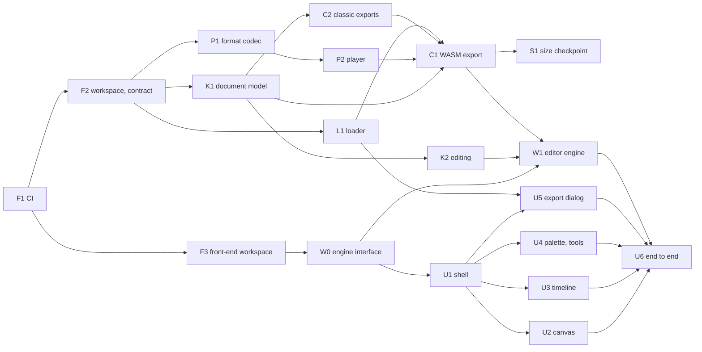
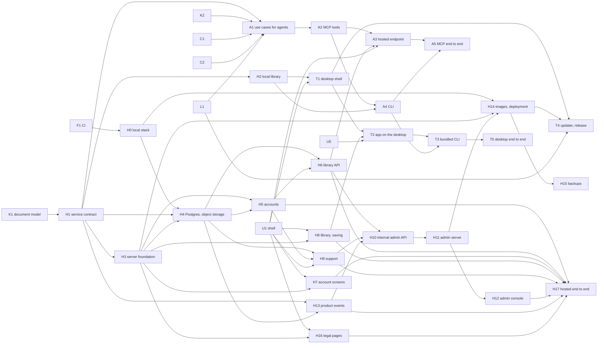

# Implementation plan

How the milestones of [product.md](product.md) become tasks that an orchestrator hands to agents
working in parallel (D19 in [decisions.md](decisions.md)). Each task says what it delivers, the
paths it owns, what it waits for and when it is done; the orchestrator writes each agent's brief
from it. M1 to M5 make V1, the first release: their tasks are detailed below, and the scope,
contracts and method of V1 are in [v1-implementation.md](v1-implementation.md). M6 and M7 are
outlined, and detailed here while V1 is under way.

## Rules of the split

- **Contracts first.** What several streams share — the export format and the player ABI, the
  document model, the editor engine's interface — is fixed by one task before the streams that
  use it start. Until the real implementation lands, they work against the contract, with
  fixtures or a mock.
- **Disjoint ownership.** Tasks that run at the same time own disjoint paths. Shared files only
  receive additions: `[workspace.dependencies]`, the CI workflows, the i18n catalogues — keys
  under the task's own feature prefix —, the documentation maps, and the other
  [shared files](v1-implementation.md#shared-files) of V1.
- **A contract changes only through the task that owns it**, and the orchestrator warns every
  task that depends on it.
- **Done means verified.** A task ships its tests — the nominal behaviour and its edge cases —,
  passes the checks of AGENTS.md that cover what it touched, updates the documentation it
  affects, and adds the CI checks, the Dependabot entry and the AGENTS.md checks of any area it
  creates.
- **One task, one branch**, named after it — `feat/format-codec`, `feat/timeline` —, merged into
  `dev` through a pull request, or into the integration branch of an orchestrated build, which
  the maintainer brings to `dev` ([v1-implementation.md](v1-implementation.md#branches)). CI comes
  first, so that it checks every task after it.
- **A brief** quotes the task's row, the [contracts](v1-implementation.md#contracts) it relies on
  and the documents it must follow: AGENTS.md always, plus those its row links.

## V1 — M1 to M5

### Foundations

| ID | Task | Owns | Waits for | Done when |
|---|---|---|---|---|
| F1 | Continuous integration | `.github/workflows/`, `.github/dependabot.yml` | — | `ci.yml`, `_verify.yml` and `security.yml` of [devops.md](devops.md) run on pull requests and on pushes to `dev`, starting with `cmp CLAUDE.md AGENTS.md`, CodeQL on the workflows and the dependency review; actions pinned to a commit SHA; Dependabot on `github-actions` |
| F2 | Cargo workspace and export contract | root `Cargo.toml`, `deny.toml`, `crates/format` | F1 | the workspace builds under the lints of AGENTS.md, and CI runs `fmt`, `clippy`, the tests and `cargo deny`; `crates/format` holds the types of payload v1 and player ABI v1 and the signatures of their codec, and its `README.md` specifies them byte by byte, linked from [export.md](export.md) |
| F3 | Front-end workspace | `frontend/` configuration, `i18n/`, `scripts/` | F1 | `projects/app` and `projects/shared` build under strict TypeScript, ESLint, Prettier at 100 columns, Vitest and Playwright; Transloco loads `i18n/en.json` and `fr.json` at runtime; CI runs the front-end checks and the catalogue check of [i18n.md](i18n.md) |

### M1 — core and player prototype

| ID | Task | Owns | Waits for | Done when |
|---|---|---|---|---|
| K1 | Document model | `crates/core` | F2 | projects, animations, palettes of 256 entries at most, layers, frames, cels and tags, with their validation and the domain limits as constants; a frame's compositing; versioned serialization, migrated on read; a frame to and from a text grid — the representation of MCP's `write_frame` and of the sample animations |
| P1 | Format codec | `crates/format` | F2 | the encoder, behind a feature, and the `no_std` decoder — bounds-checked, refusing an unknown version; round-trip tests; a `cargo fuzz` target that CI runs briefly on each pull request and longer every week, on a nightly toolchain; the v1 fixture, kept for good |
| P2 | Player | `crates/player`, `xtask/` | P1 | ABI v1 in `no_std`, without wasm-bindgen; `cargo xtask build-player` builds it reproducibly, and CI checks its hash, the 16 KiB budget and the frames it plays from the v1 fixture; every `unsafe` block carries a `// SAFETY:` comment |
| L1 | Loader and element | `player-js/` | F2 | the `<life-pixel>` element of [export.md](export.md) — attributes, methods, `tagend`, pause off-screen and in a hidden tab, reduced motion, accessible name — and the integration snippets, within 2 KiB gzipped; tested against a hand-written module implementing ABI v1, then against P2's player |
| C2 | Classic exports | `crates/compiler`, created here | K1 | GIF, APNG, sprite sheet with JSON and zipped PNG frames, deterministic, checked against golden files |
| C1 | WASM export | the WASM export's module in `crates/compiler` | K1, P2, C2, L1 | validate, flatten, encode and append the `life-pixel` section to the player built from the same commit; deterministic; golden files; the result plays in a browser through L1 |
| S1 | Size checkpoint | the sample animations, `scripts/`, the results in export.md | C1 | a few animations drawn for the project and dedicated to CC0 play in a demo page; a script measures them as WASM, GIF, APNG and WebP — the last through libwebp's tools, for the measurement only —, raw, gzipped and with brotli; the budgets of export.md are confirmed or revised once, and the sizes in [pricing.md](pricing.md) checked |

### M2 — web editor, local

| ID | Task | Owns | Waits for | Done when |
|---|---|---|---|---|
| W0 | Engine interface | `frontend/projects/app/src/app/engine/` | F3 | the TypeScript interface of the editor engine — documents, operations, undo and redo, rendering with onion skin, export, whether it holds unsaved work — and an in-memory mock of it, so that the interface is built before `editor-wasm` exists |
| U1 | Application shell | the app's root, routes and settings; `frontend/projects/shared` | W0 | the Ionic shell, lazy routes, settings with live language switching, design tokens, dark mode, reduced motion, visible focus; a warning before the page is left while it holds unsaved work, since nothing is saved without an account (D37) |
| K2 | Editing operations | the editing modules of `crates/core` | K1 | the tools and edits of the MVP in [product.md](product.md) as operations with their inverse, for undo and redo; PNG and sprite-sheet import reduced to the palette, decoded under dimension and size limits; golden images |
| U2 | Canvas | the app's `canvas/` feature | U1, W0 | zoom, pan, grid, tool input, selection overlay and onion skin, all usable from the keyboard |
| U3 | Timeline | the app's `timeline/` feature | U1, W0 | frames and their durations, layers, tags, playback preview |
| U4 | Palette and tools | the app's `palette/` and `tools/` features | U1, W0 | palette editor, tool bar, keyboard shortcuts |
| U5 | Export dialog | the app's `export/` feature | U1, W0, L1 | every format with its size side by side, download, the snippets for HTML, Angular, React and Vue |
| W1 | Editor engine | `crates/editor-wasm`, the engine's adapter | W0, K2, C1 | `editor-wasm` implements W0's interface over `core` and `compiler`, in a Web Worker, and the app leaves the mock; no pixel rule in TypeScript |
| U6 | End-to-end path | `frontend/e2e/` | U2 to U5, W1 | Playwright covers draw → animate → export → play, with automated accessibility checks on every screen: M2 is done |

### M3 — hosted beta

| ID | Task | Owns | Waits for | Done when |
|---|---|---|---|---|
| H0 | Local stack | `compose.yaml`, `compose.override.yaml`, `.env.example` | F1 | `docker compose up -d` starts the [local stack](v1-implementation.md#local-stack) — Postgres, an S3-compatible object storage, a mail catcher with an HTTP API — on `127.0.0.1` only, with healthchecks; images pinned, Dependabot on `docker`; CONTRIBUTING.md says how to start and reset it |
| H1 | Service contract | `crates/service`, created here | K1 | the ports, in-memory adapters, typed errors and contract suites of the [service contract](v1-implementation.md#service); the library use cases — create, rename, duplicate, delete, list and search by cursor, open, save with a version check — and the storage quota, with plan values from configuration |
| H2 | Local library | the local adapter of `crates/service` | H1 | the library ports on a library folder, as the [local library contract](v1-implementation.md#local-library) describes, passing H1's contract suite |
| H3 | Server foundation | `crates/server`, created here — application, configuration, middleware —; the generated client in `projects/shared` | F2, F3, H1 | the [HTTP API conventions](v1-implementation.md#http-api) at work: configuration from the environment, `/healthz`, JSON logs, OTLP traces, `/metrics` on an internal port with the `http_*` metrics by route template, problem details from service errors, the security headers and CSP of [security-model.md](security-model.md), rate limiting, the client-version check, the built app served with a fallback to `index.html`, the i18n endpoint with `ETag`; the OpenAPI description and its client committed, and checked current by CI |
| H4 | Postgres and object storage | the storage adapters and migrations of `crates/server` | H0, H1, H3 | the library index in Postgres through sqlx migrations, the documents in object storage through `object_store` — S3-compatible, or a local folder for self-hosting —, storage usage kept exact when a write fails halfway; H1's contract suite passing on the local stack; the test-database helper of the local stack |
| H5 | Accounts and sessions | the accounts modules of `crates/service` and `crates/server`, their migrations and emails | H3, H4 | sign-up, email verification, sign-in, sign-out, password reset and change, as [security-model.md](security-model.md) and D29 describe them: Argon2id, `__Host-` session cookies, CSRF checks, rate limits; emails over SMTP rendered from the `email.` keys in the account's language; `auth_events_total`; tested against the local stack and its mail catcher |
| H6 | Library and account API | the library and account routes of `crates/server` | H4, H5 | the library routes of the contract — cursor pagination, search, duplicate, delete, save with `If-Match` —; writes over the quota refused with `quota.storage_exceeded`, deleting always allowed; the account's usage, language, data export and deletion, object storage included; `storage_used_bytes`, `quota_rejections_total` |
| H7 | Account screens | the app's `account/` feature | U1, H3 | sign-up, sign-in, verification, password reset, and the account page — usage against the quota, language, data export, deletion, sign-out —, on the generated client; signing up or in never loses the work in the page (D37) |
| H8 | Library and saving | the app's `library/` feature | U1, W0, H3 | the library behind a front-end storage port and its HTTP implementation: list, search, duplicate, delete, open in the editor, save — version conflicts and the quota handled —; a visitor keeps working without saving (D37), and the first save after signing in keeps the work in progress |
| H9 | Support requests | the support modules of `crates/service`, `crates/server` and the app | H4, H5, U1 | Help → Contact of [admin-console.md](admin-console.md): a category, a message, an optional screenshot decoded under limits and re-encoded before storage, the context attached automatically; the user's requests and their replies in the app |
| H10 | Internal admin API | the admin module of `crates/server` and its listener | H6, H9, H13 | the [admin contract](v1-implementation.md#admin): users — search, profile, activity, suspend, reactivate, export, delete —, support requests — status, assignment, internal notes, replies sent by email and shown in the app —, product metrics; every action in the append-only audit log, with the admin, the time, before and after |
| H11 | Admin server | `crates/admin-server`, created here | H10 | admin accounts with Argon2id, a mandatory TOTP second factor and short sessions, and the command that creates the first one; the internal admin API relayed with the admin's identity; health, metrics, logs and alerts read from VictoriaMetrics — through a query-only proxy —, VictoriaLogs and Alertmanager, tested against fakes; its OpenAPI description and client, checked current by CI |
| H12 | Admin console | `frontend/projects/admin`, created here | H11 | the V1 part of [admin-console.md](admin-console.md): the overview, the drill-down to a request's logs — Grafana links for traces —, users, support requests, the audit log; the environment banner; time range and environment kept in the URL; keyboard, dark mode, automated accessibility checks |
| H13 | Product events | the events modules of `crates/service` and `crates/server`, their migrations | H1, H4 | H1's events port persisted as the [events contract](v1-implementation.md#product-events) says; `POST /api/v1/events` for the app's allow-list; the purge after 13 months; the aggregates the admin console shows |
| H14 | Images and deployment | `docker/`, `compose.deploy.yaml`, `_build.yml`, `_promote.yml`, `_deploy.yml` | H0, H3, H11 | the `app` and `admin` images of [architecture.md](architecture.md), non-root, with healthchecks; `compose.deploy.yaml` under the shared-VPS rules of AGENTS.md; the workflows of [devops.md](devops.md), its six deployment steps included; `.env.staging.example` and `.env.prod.example`; a self-hosting example with Postgres and a local volume in `docker/selfhost/`; Dockerfile and compose checks in CI |
| H15 | Backups | `scripts/backup/`, the backup service of `compose.deploy.yaml` | H14 | the nightly dump of devops.md — encrypted on the host, sent by credentials that cannot delete — and its restore script, both rehearsed on the local stack; the runbook in devops.md |
| H16 | Legal pages | the app's `legal/` feature, `i18n/legal/` | U1, H3 | terms, privacy policy and legal notice in English and French, served by the i18n endpoint — as i18n.md then describes — and linked from the app; the privacy policy drafted from [security-model.md](security-model.md); the identity from configuration; every sentence the maintainer must write or confirm marked, and listed in the task's report |
| H17 | Hosted end to end | `frontend/e2e/hosted/` | H5 to H13, H16 | Playwright on the local stack: visitor → sign-up → verification read from the mail catcher → save → library, search, duplicate, delete → quota reached, under a small quota from configuration → data export → deletion; a support request answered from the admin console, and the reply seen in the app; accessibility checks on every new screen: M3 is done |

### M4 — MCP

| ID | Task | Owns | Waits for | Done when |
|---|---|---|---|---|
| A1 | Use cases for agents | the editing and export modules of `crates/service` | H1, K2, C1, C2, L1 | with H1's library use cases, what the tools of [mcp.md](mcp.md) need: read an animation without its pixels, set the palette, write a frame from a text grid, draw a batch, edit frames, set tags, render a capped PNG preview or contact sheet, export every format, produce a snippet from L1's templates — under the validation, limits and quota of the interface |
| A2 | MCP tools | `crates/mcp`, created here | A1 | the tools and the resource of mcp.md on `rmcp`, whatever the transport: English names, descriptions and schemas, stable error codes, paginated lists, previews within their caps, user content returned as data; tested through an in-memory transport |
| A3 | Hosted MCP endpoint | the MCP and tokens modules of `crates/service` and `crates/server`, the app's `tokens/` feature | A2, H6, U1 | Streamable HTTP on `/mcp`, named after its environment ([devops.md](devops.md)); personal access tokens as mcp.md describes them, managed from the app's settings; per-token rate limits and the plan's daily ceiling; exports through short-lived signed links, compiled on demand; `mcp_tool_calls_total` and `mcp_tool_duration_seconds`; the user's tokens in the internal admin API |
| A4 | CLI | `crates/cli`, created here | A2, H2 | `life-pixel mcp` over stdio on the local library, with the local writes of mcp.md and the [local library contract](v1-implementation.md#local-library); `life-pixel list` and `life-pixel export` |
| A5 | MCP end to end | the MCP tests of `crates/cli/tests/` and `crates/server/tests/` | A3, A4 | an MCP client plays one scripted session on each transport — create, write, draw, preview, tag, export, snippet — and the exported `.wasm` plays through L1's loader: M4 is done |

### M5 — desktop

| ID | Task | Owns | Waits for | Done when |
|---|---|---|---|---|
| T1 | Desktop shell | `tauri/`, created here | H2, U1 | Tauri 2 in desktop mode ([architecture.md](architecture.md)): `service` in-process on the local library, commands mirroring the library API, the library folder in the settings, the catalogues served locally at `/i18n`, a strict CSP and the fewest capabilities, no network call; it builds on Windows, macOS and Linux |
| T2 | App on the desktop | the app's `platform/` feature | T1, H8, U5 | the desktop implementations of the app's ports — the library, exports saved through the system's dialog —, chosen at start-up; no account screen on the desktop |
| T3 | Bundled CLI | the sidecar and the library watcher of `tauri/`, the app's `mcp/` settings | T2, A4 | the `life-pixel` CLI shipped as a sidecar; the settings show the `claude mcp add` command with its absolute path; an agent's changes to the library appear in the app, and an open animation changed on disk while it holds unsaved work asks before reloading |
| T4 | Updater and release | the updater of `tauri/`, `release.yml` | T1, H14, L1 | the signed Tauri updater, off unless the release sets its endpoint and key; the `release.yml` of [devops.md](devops.md) without Android: installers for Windows, macOS and Linux, signed from the `release` environment, `@life-pixel/player` through trusted publishing, the Docker version tags, a GitHub Release with provenance attestations; checked with `actionlint` |
| T5 | Desktop end to end | the desktop tests and their CI job | T3 | a WebDriver smoke test through `tauri-driver` — start, create, draw, export, find it in the library —, run in CI on Linux; a manual checklist for macOS, which `tauri-driver` cannot drive: M5 is done |

### Closing V1

| ID | Task | Owns | Waits for | Done when |
|---|---|---|---|---|
| R1 | Release readiness | the status in README.md, the development loop in CONTRIBUTING.md | every task above | the [definition of done](v1-implementation.md#definition-of-done) met on the integration branch; README.md and CONTRIBUTING.md describe what was built; the maintainer's [release steps](v1-implementation.md#release) checked against it: V1 is complete |

### Order

M1 and M2:

M3 to M5, with the tasks of M1 and M2 they wait for:

In waves, each followed by its
[integration step](v1-implementation.md#waves-and-integration-steps):

| Wave | Tasks |
|---|---|
| 1 | F1 |
| 2 | F2, F3, H0 |
| 3 | K1, P1, L1, W0 |
| 4 | K2, P2, C2, U1, H1 |
| 5 | C1, U2 to U5, H2, H3 |
| 6 | S1, W1, H4, H7, H8, H16, A1, T1 |
| 7 | U6, H5, H13, A2, T2 |
| 8 | H6, H9, A4 |
| 9 | H10, A3, T3 |
| 10 | H11, A5, T5 |
| 11 | H12, H14 |
| 12 | H15, H17, T4 |
| 13 | R1 |

The longest chain — F2 → K1 → H1 → H3 → H4 → H5 → H6 → H10 → H11, then H12 → H17 or H14 →
H15 — sets the pace of V1: the orchestrator staffs it first. M1 and M2 follow two chains of their
own — F2 → P1 → P2 → C1 → W1 and F2 → K1 → K2 → W1 —, while the interface tasks run on W0's mock.

## Later milestones

Outlined only: each is split into tasks here while V1 is under way. The last column is what only
the maintainer can provide; starting it early avoids waiting on it.

| Milestone | Streams | Needed from the maintainer |
|---|---|---|
| M6 — Android | the OAuth 2.1 authorization server, with PKCE, in `server`; the Android build of `tauri/`, back from the system browser through App Links, tokens in the keystore | a Play Console account and its two-week closed test, the upload key (D32) — a month ahead |
| M7 — paid plans | the billing port and the merchant-of-record adapter (D30), plans from configuration (D31); the services they sell (D25): live embeds on `embed.lifepixel.tech` behind a CDN, sync, version history, team workspaces | the merchant-of-record account, and an entity able to sell |
